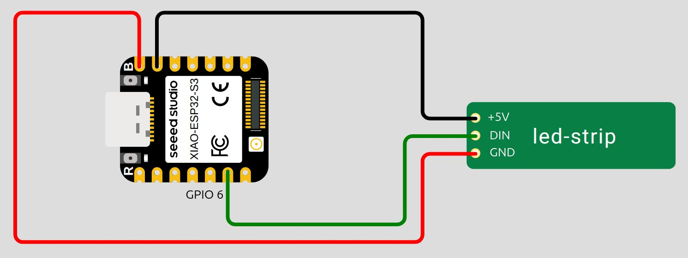
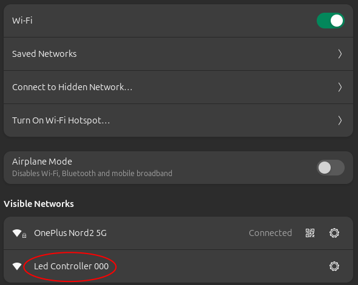
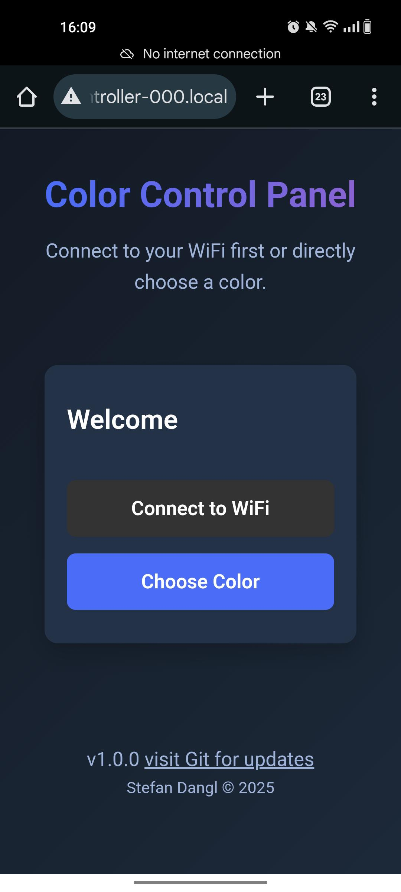
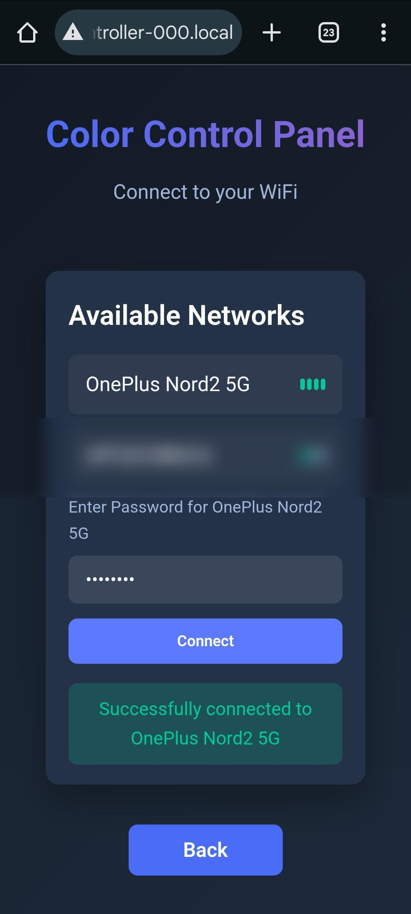
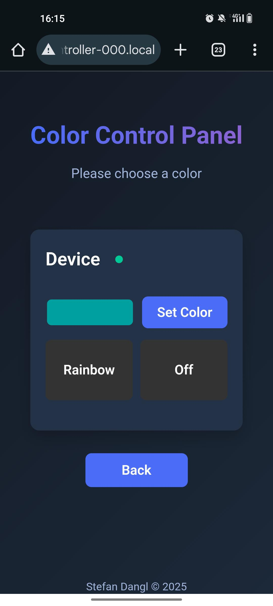
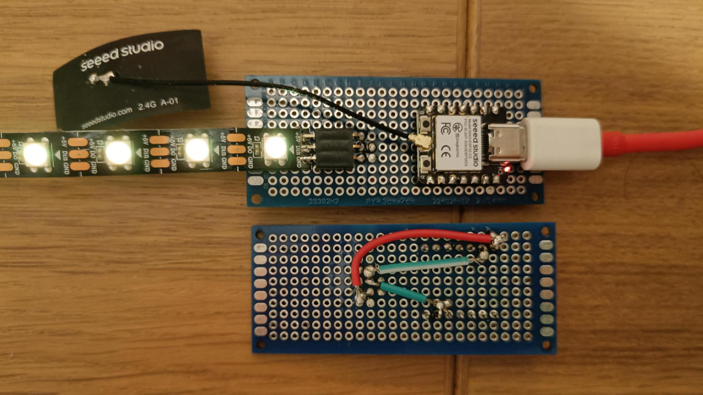

[](https://github.com/stefan-dangl/led-controller/actions)

# esp32-led-controller

Allows to control the colors of an LED strip via smartphone or PC.

## Required hardware

This project is based on the ESP32-S3 MCU. The following components were used:
- Seeed Studio XIAO ESP32-S3
- WS2812 Neo Pixel Led Light Strip

The code was tested on the ESP32-C3 as well. Besides changing some configuration files, the ESP32-C3 required no adaptation of the source code. However, it's important to note that the pin used for controlling the LED strip (GPIO6) is at different locations on the S3 and C3, as can be seen in the following schematics.  

<figure id="fig1">
  
  <figcaption>Figure 1: ESP32-S3 schematics drawn with Wokwi.</figcaption>
</figure>

<figure id="fig2">
  
  <figcaption>Figure 2: ESP32-C3 schematics.</figcaption>
</figure>


## How to flash

1) This project heavily uses the ESP-IDF framework. You can find useful information about it [here](https://docs.esp-rs.org/std-training/01_intro.html) and [here](https://github.com/esp-rs/esp-idf-template).
2) Execute the following commands for building the project and flashing it on the connected ESP32-S3 or ESP32-C3. Hint: If flashing doesn't work, you may have to modify the permissions of the device descriptor.

``` Bash
cd led-controller
cargo build
```

``` Bash
espflash flash target/xtensa-esp32s3-espidf/debug/led-controller --monitor  # ESP32-S3 
```

``` Bash
espflash flash target/riscv32imc-esp-espidf/debug/led-controller-c3  --monitor  # ESP32-C3
```


## How to use

Once the ESP32 is flashed, you can use it as follows:

1) When powered on, the ESP creates a WiFi access point with an SSID like *LED Controller 000* (configurable). Make sure to connect the antenna to your ESP device. After powering the device, the LEDs light yellow.

<figure id="fig2">
  
  <figcaption>Figure 3: LED Controller Access Point</figcaption>
</figure>

2) After connecting your smartphone or PC to the ESP's access point, enter *led-controller-000.local* (configurable) in your browser. This will open a welcome page where you can either connect the ESP to your local WiFi or control the colors directly.

<figure id="fig3">
  
  <figcaption>Figure 4: Welcome Page, shown when entering led-controller-000.local in your browser.</figcaption>
</figure>

3) When you click "Connect to WiFi", the ESP will scan for available networks and display them. Select your WiFi network from the list to connect. Once successfully connected the LEDs switch to cyan. You can access the ESP from within your WiFi network now. Note that this will disable the ESP's access point. If you need to re-enable the access point, simply reboot the device by unplugging and replugging the power cable or pressing the reset button. If your WiFi network temporarily goes down after setup, the ESP will automatically reconnect once your WiFi is available again.

<figure id="fig4">
  
  <figcaption>Figure 5: Connect to WiFi</figcaption>
</figure>

4) When you click "Choose Colors" you have three options: freely choosing a color, activating rainbow mode, or turning off the LEDs. More options are planned to be added in the future.

<figure id="fig5">
  
  <figcaption>Figure 6: Control the colors of your Led Strip.</figcaption>
</figure>


## Notes

I built some LED Controllers for my family and friends. If you need help assembling them or want pre-soldered ones, let me know.  

<figure id="fig6">
  
  <figcaption>Figure 7: Soldered Led Controller.</figcaption>
</figure>