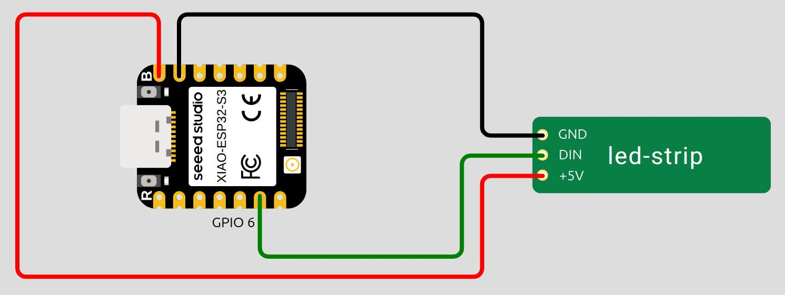
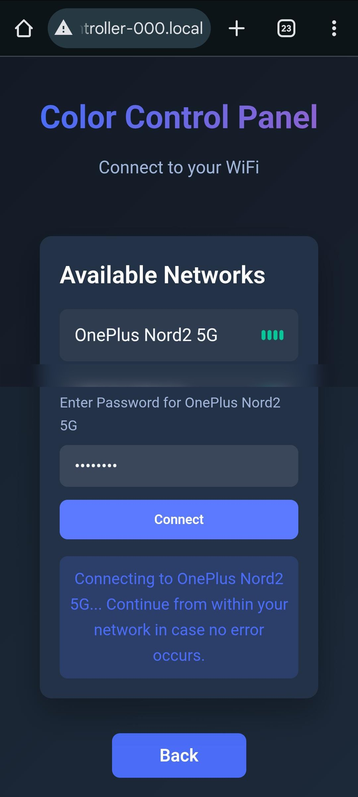

# esp32-led-controller

Fully functional IoT LED Controller. Allows you to control the colors of an LED strip via smartphone or PC.

## Required hardware

This project is based on the ESP-S3 MCU. The following components were used:
- Seeed Studio XIAO ESP32-S3
- WS2812 Neo Pixel Led Light Strip

The code should work with similar hardware as well, requiering more or less adaptation.

<figure id="fig1-schematics">
  
  <figcaption>Figure 1: Schematics drawn with Wokwi.</figcaption>
</figure>


## How to flash

1) This project heavily uses the ESP-IDF framework. You can find useful information about it [here](https://docs.esp-rs.org/std-training/01_intro.html).
2) Execute the following commands in the project's root directory for building the project and flashing it on the connected ESP32-S3. Hint: If flashing doesn't work, you may have to modify the permissions of the device descriptor.

``` Bash
cd led-controller
cargo build --release
espflash flash target/xtensa-esp32s3-espidf/debug/led-controller --monitor
```


## How to use

Once the ESP32 is flashed, you can use it as follows:

1) When powered on, the ESP will open a WiFi access point with an SSID like *LED Controller 000* (configurable). Make sure to not forget to connect the antenna to your ESP device.

<figure id="fig1-schematics">
  
  <figcaption>Figure 2: LED Controller Access Point</figcaption>
</figure>

2) When connected to the network provided by the ESP, enter *led-controller-000.local* (configurable) in your browser. This will lead you to a welcome page where you can either connect the ESP to your local WiFi or control the colors directly.

<figure id="fig1-schematics">
  
  <figcaption>Figure 3: Welcome Page, shown when entering led-controller-000.local in your browser.</figcaption>
</figure>

3) When clicking on *Connect to WiFi*, the ESP will take a moment to scan the available WiFi networks and list them. To connect, choose a WiFi from the list. If successful, you can access the ESP from within your WiFi network now.

<figure id="fig1-schematics">
  
  <figcaption>Figure 4: Connect to WiFi</figcaption>
</figure>

4) You can modify the colors using the color panel, which provides three functionalities: freely choosing a color, activating rainbow mode, or turning off the LEDs.

<figure id="fig1-schematics">
  
  <figcaption>Figure 5: Color Panel, control the colors of your Led Strip.</figcaption>
</figure>


## Notes

I built some LED Controllers for my family and friends. If you need help assembling them or want pre-soldered ones, let me know.
